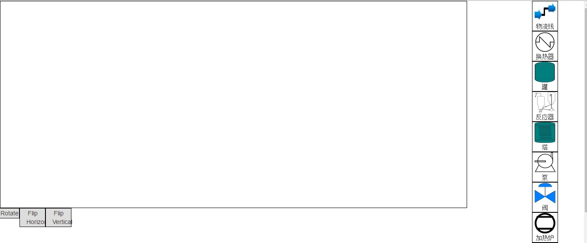

#Flowsheet架构

---
#####Flowsheet DEMO



> 功能目的制作Web的flowsheet 需求提出方 圣泰 附件（模型、例题）
>
> 文档编写负责人 Long, Huilong 修订 Rev 发布时间 修订内容 1 2016.12.9 讲述了flowsheet的架构 2

### **Flowsheet Demo**

```
Flowsheet有两种模式，一种是添加模式，另一种是拖拽模式。
```