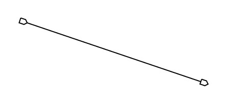
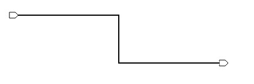
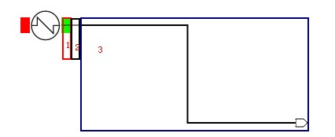
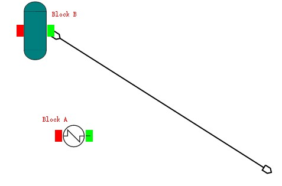
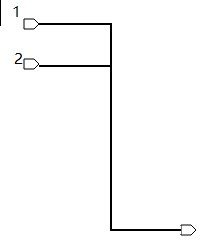
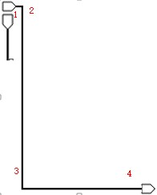
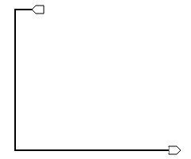
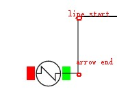
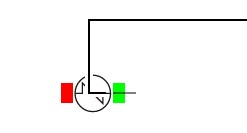
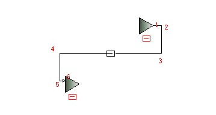

###Stream

** Stream 添加：**

` `
**添加物流到空白处 单击物流线tile，然后在flowsheet上单击，绘制物流线的起点。在flowsheet上进行第二次点击，确定物流线的终点，绘制一整条物流线。这个过程包含两步：**

` `
1.绘制了物流线的起点后，终点是鼠标的位置，鼠标可以任意移动，线条会随着鼠标的移动而移动，线条是直的。

` `2.第二次点击鼠标，绘制线条的终点，将会形成折线，形成的折线有起始箭头，也有结束箭头。若鼠标右键点击flowsheet，取消掉stream的添加。

**   添加物流到Block上 当把物流线的起点设定在block的port上时，就会给stream添加source。当鼠标第二次点击时，stream被绘制完成，同时把stream添加到block的outlet上。**

 

如上图所示，整个物流线是由三段组成，第一段是block的port线，第二段是stream的start箭头，由于连接了block，变成了直线，第三段是stream的其他线。 

##拽动 
** 从连接block A到连接Block B**
 

当鼠标将物流线从block A拽到block B时，会有如下几个步骤：

1. 鼠标点击物流线的startArrow，物流线删掉source信息，block A的outlet去除物流，同时折线变成了直线。
2. 拖动鼠标时， 箭头随着鼠标的移动而移动。
3. 当鼠标在Block B的port放开时，物流将source设置为block B，同时block B 将物流添加到outlet中，保存物流的连接位置信息，方便拖动block时，可以移动stream。
 
**从连接block到不连接block **  

第一步与第二步同上，只是第三步不用保存连接信息。

** 从不连接到不连接block**

4. 鼠标点击arrow时，折线变成了直线。
5. 拖动鼠标时， 箭头随着鼠标的移动而移动。
6. 松开鼠标，确定了arrow的新终点，stream由直线变成了折线。

** 从不连接block到连接block**

7. 鼠标点击arrow时，折线变成了直线。
8. 拖动鼠标时， 箭头随着鼠标的移动而移动。
9. 当鼠标在Block B的port放开时，物流将source设置为block B，同时block B 将物流添加到outlet中，保存物流的连接位置信息，方便拖动block时，可以移动stream。 

##拖动 

###无source连接时 

**拖动第一根线或者最后一根线**

 

` `
当拖动第一根线或者最后一根线时，会同时移动线条上的箭头。 

**拖动第二根线或者倒数第二根线**

  

` `
当移动第二根线或者倒数第二根线时，会让箭头出现三种状态： 
* 箭头从左到右: 当第二个点的横坐标比第一个点的横坐标大15\(箭头的长度\)时，箭头从左到右。 
* 箭头垂直: 当第二个点的横坐标与第一个点的横坐标相差小与15时，使用垂直箭头。箭头上下的方向由地1个点和第三个点来决定。 
* 箭头从右到左: 当第二个点的横坐标比第一个点的横坐标小15\(箭头的长度\)时，箭头从左到右。 
###有source连接时 
** 拖动第一根线或者最后一根线**

 

` `
拖动第一根线时，会在arrow和line的第一个点之间用线连起来，这个线只起一个连接的作用，不能用于拖拽。

** 拖动第二根线或者倒数第二根线**

` `
当拖动第二根线的时候，source 的arrow方向已经确定了，是不允许改变的。

### 线条的布局及点的个数 
线的箭头方向是被block的port方向决定的。

` `如上图所以，1,2和5,6两个点是被port的方向固定的。当发现3和5无法直接连城一条垂直的线时，就取y轴的中间值，形成一条直线。 

**线条的层级关系 **

` `由于鼠标点击在Arrow上时，jquery无法捕捉到点击事件，所以把arrow放到了svg的最底层。有时我们可以看到箭头被block的图片遮住了。 
